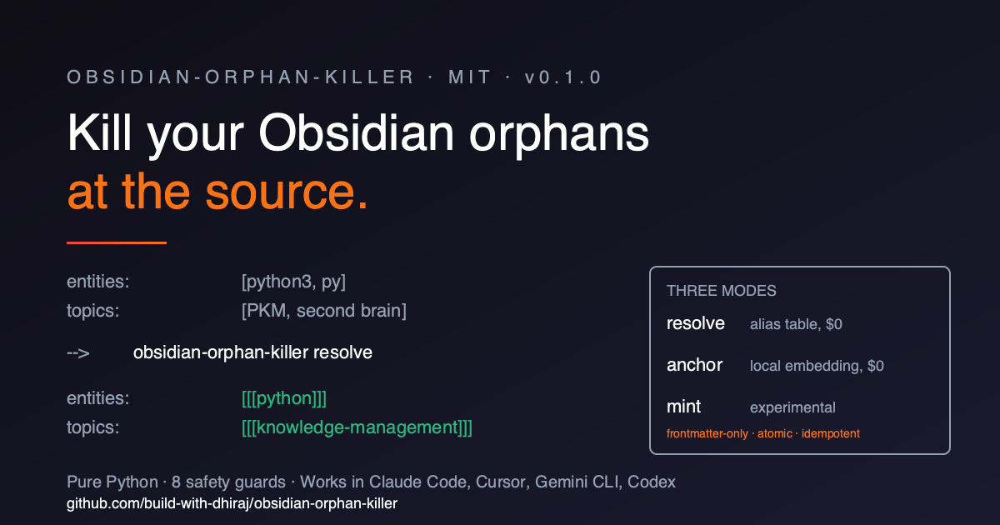

# obsidian-orphan-killer



> Fix Obsidian orphans at the source. Auto-link orphan notes in any markdown vault that uses `[[wikilinks]]`. Three modes. Frontmatter-only writes. Atomic. Idempotent. Pure Python.

[](LICENSE)
[](pyproject.toml)
[](tests/)
[](SKILL.md)

---

## What does obsidian-orphan-killer do?

`obsidian-orphan-killer` is a command-line tool that **fixes Obsidian orphans** by auto-linking unlinked notes to the right hub. It is the first PKM tool that **auto-links** orphans, not just lists them. Three modes ship: a deterministic alias-table `resolve`, a local-embedding `anchor`, and an experimental `mint` that clusters orphans and creates new concept hubs for coherent groups.

**What it produces:**
- plain-string entities/topics in your note frontmatter are rewritten to canonical `[[wikilinks]]` (deterministic, $0)
- true-orphan leaves get attached to their single best matching existing hub (local embeddings, $0)
- coherent clusters of orphans get a new hub minted for them and members anchored (experimental)

**What it never does:**
- touch your note body bytes
- write a dangling link
- force a low-confidence match
- require an Obsidian plugin install

---

## Safety guards (read this first)

This is a tool that WRITES to your vault. The contract has to come before the features.

| Guard | What it means | Where it lives |
|---|---|---|
| **Frontmatter-only writes** | Body bytes are never modified. The body-only content hash is unchanged after every run. | `tests/test_resolve.py::test_resolve_body_hash_preserved`, `tests/test_anchor.py::test_anchor_body_hash_preserved` |
| **Atomic writes** | tempfile + `os.rename`. No partial writes; if the process is killed mid-write, the original file is intact. | `obsidian_orphan_killer/fm.py::write_atomic` |
| **Idempotency stamps** | Every write records `raw_meta.resolved_at` / `anchored_at` / `clustered_at` and a content hash. A second run on unchanged notes is a no-op. | `tests/test_resolve.py::test_resolve_idempotent`, `tests/test_anchor.py::test_anchor_idempotent` |
| **Dangling-link guard** | A plain string is rewritten to `[[slug]]` ONLY if `slug.md` exists in a hub directory. Otherwise it stays plain. | `tests/test_resolve.py::test_resolve_never_writes_dangling_links` |
| **Per-hub absorption cap** | `--max-per-hub N` bounds how many orphans any one hub can absorb per run. Default 50. Anti-star: even a pathological embedding space can't rebuild a force-star. | `tests/test_anchor.py::test_anchor_max_per_hub_caps_absorption` |
| **Cosine floor** | The anchor mode's `--floor` (default 0.74) means weak matches stay unlinked. | `tests/test_anchor.py::test_anchor_below_floor_leaves_unlinked` |
| **Concepts-only by default** | The anchor mode targets only `concepts/` hubs by default. Opt in to `entities/` with `--include-entities`. Prevents the brand-leak class (generic how-to → product hub). | `tests/test_anchor.py::test_anchor_concepts_only_default` |
| **DO_NOT_MERGE pairs** | User-supplied pairs that look similar but must never collapse (e.g. `claude-ai` vs `claude-code`). | `tests/test_guards.py::test_do_not_merge_user_pairs` |
| **Mint mode requires `--experimental`** | Mint mode writes NEW notes; refused unless the user opts in explicitly. | `tests/test_cli.py::test_cli_mint_requires_experimental_flag` |

Full contract with recovery instructions: [`docs/SAFETY.md`](docs/SAFETY.md). The formal spec lives at [`docs/RUBRIC.md`](docs/RUBRIC.md).

---

## Why your Obsidian vault has orphans (and why nothing fixes them)

Every Obsidian forum has 8+ threads about orphan notes. Every PKM tool surfaces the problem: Find Unlinked Files (Vinzent03), Various Complements, Janitor, Dangling Links (Curtis McHale), Smart Connections (Brian Petro). They all list orphans. None fix them.

Fixing orphans is hard because three different failure modes are tangled together:

1. **Plain-string entities that should be wikilinks.** A note carries `entities: [PKM, Microscopy]` instead of `entities: [[[knowledge-management]], [[microscopy]]]`. The hub already exists. No tool resolves this automatically.
2. **True orphan leaves with no hub.** A long-form note about graph theory has no outbound wikilink and no inbound link. The relevant hub exists; the note just doesn't link to it.
3. **Coherent topic clusters with no hub at all.** 8 notes about protein crystallization. No hub. Listing them as orphans doesn't help because there's nothing to link them to.

orphan-killer handles all three with safety guards strong enough to trust on a live vault. The wedge is the action verb plus the contract.

---

## The three modes

### `resolve` — deterministic, $0

Walks your vault's `entities:` and `topics:` frontmatter lists. For each plain string, looks it up in an alias table built from every hub note's filename, title, and `aliases:` frontmatter. Rewrites to `[[slug]]` only if the hub exists on disk. Never writes a dangling link.

```bash
obsidian-orphan-killer resolve --vault ~/Documents/MyVault --dry-run
obsidian-orphan-killer resolve --vault ~/Documents/MyVault
```

### `anchor` — local embedding, $0 after one-time model download

For each true orphan with enough body to embed, finds the single nearest existing hub by cosine similarity (using `BAAI/bge-small-en-v1.5` via fastembed). Attaches one `[[hub]]` to `entities:` IFF cosine >= floor. Below the floor, stays unlinked.

```bash
obsidian-orphan-killer anchor --vault ~/Documents/MyVault --dry-run
obsidian-orphan-killer anchor --vault ~/Documents/MyVault
```

### `mint` — EXPERIMENTAL, writes new notes

For orphans that no existing hub can absorb, clusters them by cosine-similarity-graph community detection. For each cluster with >= `min_cluster` members, asks an LLM to name the shared topic and judge coherence. Coherent clusters get a new `concepts/` hub minted; members get anchored to it. Always dry-run first. Always read the audit TSV.

```bash
obsidian-orphan-killer mint --vault ~/Documents/MyVault --experimental --dry-run
obsidian-orphan-killer mint --vault ~/Documents/MyVault --experimental
```

---

## Try it on the demo vault

A tiny intentionally-broken vault ships at `examples/demo-vault/`. Clone the repo and run:

```bash
cd examples/demo-vault
obsidian-orphan-killer resolve --vault . --dry-run
```

Expected output:

```
=== obsidian-orphan-killer resolve ===
vault:                  .
alias-table hubs:       4
alias-table entries:    11  (collisions: 0)
scanned:                7
skipped (unchanged):    0
notes with resolution:  3
resolved occurrences:   9
residual occurrences:   2
distinct residual keys: 2
top residual surface forms (normalized key, count):
   someunknownlibrary                  1
   somethingthatdoesnotresolve         1
```

After `resolve` (live), `sources/learning-python-basics.md` has its `entities: [python3, py]` rewritten to `entities: [[[python]]]`. The unresolvable strings are reported and left in place.

---

## Recommended workflow

The two-tool flow:

1. **Audit** with [`obsidian-graph-auditor`](https://github.com/build-with-dhiraj/obsidian-graph-auditor): how many orphans, where the mega-hubs are, what the rubric grades. Read-only.
2. **Resolve** with `obsidian-orphan-killer resolve --dry-run` to see the alias-table rewrites. Approve. Run live.
3. **Anchor** with `obsidian-orphan-killer anchor --dry-run`. Read the per-candidate TSV at `<vault>/orphan_killer_audit/anchor.tsv`. Approve. Run live.
4. **(Optional)** Mint with `obsidian-orphan-killer mint --experimental --dry-run`. Read the cluster names and the audit TSV. Only if approved, run live.
5. **Re-audit.** The graph rubric should now grade dimensions you broke.

---

## How to install

### Python / PyPI

```bash
pip install obsidian-orphan-killer

# Optional extras for the anchor + mint modes (local embeddings):
pip install 'obsidian-orphan-killer[embed]'

# Mint mode also wants an LLM client (default uses OpenAI):
pip install 'obsidian-orphan-killer[mint]'
```

The `resolve` mode has no embedding deps and is the safest entry point.

### Claude Code

```bash
pip install 'obsidian-orphan-killer[embed]'
mkdir -p ~/.claude/skills
git clone https://github.com/build-with-dhiraj/obsidian-orphan-killer ~/.claude/skills/obsidian-orphan-killer
```

Then ask: *"fix my obsidian orphans at ~/Documents/MyVault"*. Claude Code reads `SKILL.md` and invokes the CLI.

### Cursor

```bash
pip install 'obsidian-orphan-killer[embed]'
mkdir -p ~/.cursor/skills
git clone https://github.com/build-with-dhiraj/obsidian-orphan-killer ~/.cursor/skills/obsidian-orphan-killer
```

### Gemini CLI

```bash
pip install 'obsidian-orphan-killer[embed]'
mkdir -p ~/.gemini/skills
git clone https://github.com/build-with-dhiraj/obsidian-orphan-killer ~/.gemini/skills/obsidian-orphan-killer
```

### Codex CLI

```bash
pip install 'obsidian-orphan-killer[embed]'
mkdir -p ~/.codex/skills
git clone https://github.com/build-with-dhiraj/obsidian-orphan-killer ~/.codex/skills/obsidian-orphan-killer
```

---

## How it compares

| | obsidian-orphan-killer | Find Unlinked Files | Various Complements | Janitor | Dangling Links | Smart Connections | obsidian-graph-auditor |
|---|---|---|---|---|---|---|---|
| Lists orphans | yes | yes | yes | yes | yes | partial | yes |
| **Auto-fixes orphans** | **yes** | no | no | no | no | no | no |
| Frontmatter safety contract | **yes (8 guards)** | n/a | n/a | n/a | n/a | n/a | read-only |
| CLI / scriptable | **yes** | no (plugin) | no (plugin) | no (plugin) | no (plugin) | no (plugin) | yes |
| Cross-CLI skill compat | **yes** | no | no | no | no | no | yes |
| Local embeddings ($0) | yes | n/a | n/a | n/a | n/a | partial | n/a |
| Cluster + mint hubs | **yes (experimental)** | no | no | no | no | no | no |
| No GPT required (default) | yes (resolve/anchor) | yes | yes | yes | yes | no | yes |
| MIT licensed | yes | varies | yes | yes | yes | partial | yes |

Full feature matrix and analysis in [`docs/COMPARISON.md`](docs/COMPARISON.md).

**Audit with `obsidian-graph-auditor`. Fix with `obsidian-orphan-killer`.**

---

## FAQ

### Will this delete or rewrite my notes?
No. The orphan-killer modifies frontmatter values ONLY. The body bytes — title, headings, paragraphs, code blocks — are never touched. Every test asserts the body-only content hash is unchanged after every run.

### What if a resolved hub doesn't exist?
The plain string is left alone. The dangling-link guard means we never write `[[slug]]` unless `slug.md` exists in a hub directory. Unresolved surface forms are reported in the `top_residuals` list so you can decide whether to mint a hub for them later.

### Can I undo it?
Every write is a single-line YAML mutation in the frontmatter. `git diff` shows it exactly; `git checkout -- <file>` reverts it. The idempotency stamps mean a re-run on unchanged notes is safe — you can't accidentally re-write something that's already correct.

### Does it work with Logseq / Roam / Quartz?
Yes for `resolve` — the alias-table builder works on any markdown directory with frontmatter aliases. Pass `--hub-dirs your-dirs` if your convention is different from `entities,concepts`. Anchor and mint also work with the same flexibility.

### Why is mint mode "experimental"?
Because it writes NEW notes (new concept hubs). The other modes only modify existing frontmatter. Mint is gated behind `--experimental` so it can never be enabled by accident. Three deterministic guards fire BEFORE any new hub is written: the topic denylist, the URL-fragment check, and the generic-catch-all backstop. Plus the LLM coherence judge. Plus a duplicate-hub check. Plus a spread-too-wide reject. Mint mode is not "throw an LLM at it"; it is a fenced sequence of cheap deterministic checks with a single LLM call in the middle.

### What if the LLM names a junk hub?
It's rejected. The mint guards are:
- `TOPIC_DENYLIST` (generic words like "Technology", "Information", "Tips")
- `CLUSTER_GENERIC_DENY` backstop (single-word catch-alls like "Science", "Videos")
- `URL fragment` (anything that looks like a domain)
- Significant-token check (must have at least one alphanumeric token >= 3 chars)
- LLM coherence judge says NO
- Cluster spread > `max-spread` (the cluster is a grab-bag)

Any one failing → the cluster's orphans stay as haystack leaves. The contract is **a missed cluster is cheap; a junk hub is not**.

### How long does it take?
- `resolve`: sub-second for a 3,000-note vault. The bottleneck is YAML parsing.
- `anchor`: dominated by the one-time fastembed model download (~50MB). After that, ~10 seconds per 1,000 orphans on a modern laptop.
- `mint`: anchor's time + one LLM call per qualifying cluster.

### Can I plug in a different LLM?
Yes. Pass `cluster_mint(..., llm_namer=your_callable)` where `your_callable(sample_titles) -> (coherent: bool, topic: str|None)`. The default reads `OPENAI_API_KEY`; you can wire up Anthropic, a local Ollama, or anything else.

### What about the embedding model?
Defaults to `BAAI/bge-small-en-v1.5` at `max_length=256` via fastembed. Local, $0 after one-time download (~50MB), runs on CPU. Pass `embedder=your_embedder` to override.

---

## Documentation

- [`SKILL.md`](SKILL.md): Cross-CLI skill manifest (Claude Code, Cursor, Gemini CLI, Codex)
- [`docs/SAFETY.md`](docs/SAFETY.md): The safety contract, recovery instructions, dry-run convention
- [`docs/RUBRIC.md`](docs/RUBRIC.md): The formal guard spec (for contributors)
- [`docs/COMPARISON.md`](docs/COMPARISON.md): Feature matrix vs Find Unlinked Files / Various Complements / Janitor / Dangling Links / Smart Connections / obsidian-graph-auditor
- [`CHANGELOG.md`](CHANGELOG.md): Release history
- [`CONTRIBUTING.md`](CONTRIBUTING.md): How to file issues, run tests, propose new modes

---

## License

MIT, Copyright (c) 2026 Dhiraj Singh Pawar.

---

## Credits

Built by [Dhiraj Singh Pawar](https://github.com/build-with-dhiraj). Engine derived from a year of orphan-fixing work on a 3,000-note vault and adapted to be tool-agnostic. Companion to [obsidian-graph-auditor](https://github.com/build-with-dhiraj/obsidian-graph-auditor): the auditor diagnoses, the orphan-killer treats.
